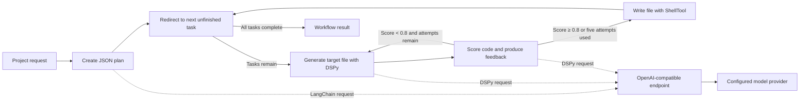

# Multi-Agent Code Generation

An experimental autonomous development workflow that turns a natural-language
software request into a modular implementation plan, generates the requested
files, reviews them, and writes the result to disk.

The product models an AI development team as distinct roles inside one
LangGraph workflow: an architect creates the plan, a developer generates each
file, and a reviewer scores the result and supplies feedback. These roles run
sequentially in a state graph; they are not independent agents running in
parallel. DSPy and LangChain provide the structured LLM calls, while `agent/`
contains an example project produced by the workflow.

> [!WARNING]
> The notebook can create or overwrite files inside `agent/` through shell
> commands. Review the requested task and generated code before running the
> file-writing steps, and use a sandbox for untrusted prompts or output.

## How it works




The workflow:

1. Converts the request into a JSON architecture and dependency-aware task list.
2. Selects the next unfinished task.
3. Generates code for that task's target file.
4. Reviews the output and makes up to five total generation attempts, carrying the latest feedback into the next attempt.
5. Writes the final attempt under `agent/` and continues until all tasks finish.

## Features

- Structured architecture and implementation planning
- Dependency-aware, file-by-file code generation
- Iterative code review with quality feedback
- LangGraph state-based orchestration
- OpenAI-compatible model integration through LangChain and DSPy

## Requirements

- Python 3.12 recommended
- Access to an OpenAI-compatible chat-completions endpoint
- JupyterLab or Jupyter Notebook

## Installation

From the project directory, create a virtual environment and install the
dependencies:

```bash
python -m venv .venv
source .venv/bin/activate
python -m pip install --upgrade pip
python -m pip install \
  openai flask \
  langchain langchain-openai langchain-community \
  langgraph langsmith dspy-ai \
  python-dotenv pydantic tavily-python ipython jupyter
```

The existing `requirement.txt` records some of the project's packages as shell
commands rather than in standard pip requirements format, so the installation
command above is the reliable setup path for the current repository.

## LLM backend

`main.ipynb` currently expects an OpenAI-compatible server at
`http://127.0.0.1:8000/v1` exposing a model named `gptoss`:

```python
llm = ChatOpenAI(
    model="gptoss",
    base_url="http://127.0.0.1:8000/v1",
    api_key="dummy",
)
```

Change these values in the notebook if you use a different endpoint or model.

Configure the credentials required by your chosen model provider through
environment variables. Never commit `.env` or other credential files.

## Usage

### 1. Run the agent workflow

In a second terminal:

```bash
jupyter lab main.ipynb
```

Run the notebook cells in order. At the bottom of the notebook, change the
request and invoke the compiled workflow:

```python
query = "Build a Flask to-do application with routes, services, HTML, and CSS."
result = agent.invoke({"query": query})
```

Generated files are written under `agent/`.

### 2. Run the generated example

The repository currently includes a Flask prime-number checker:

```bash
python agent/app.py
```

Open <http://127.0.0.1:5000> in a browser.

## Project structure

The version-controlled product contains:

```text
.
├── main.ipynb          # LangGraph/DSPy planning and generation workflow
├── agent/              # Generated application files and current example
│   ├── app.py
│   ├── prime_checker.py
│   ├── static/
│   └── templates/
├── requirement.txt     # Original dependency notes
└── LICENSE             # MIT license
```
## Current limitations

- Generated code is written directly to disk without a confirmation step.
- The quality score is produced by an LLM rather than an automated test suite.
- A clean clone needs a separately configured OpenAI-compatible LLM endpoint.
- The default endpoint and model name are hard-coded in the notebook.
- The architect, developer, and reviewer are logical roles in a sequential
  graph, not independently scheduled or parallel agents.
- The example application enables Flask debug mode and is intended only for
  local development.

## License

This project is licensed under the [MIT License](LICENSE).
